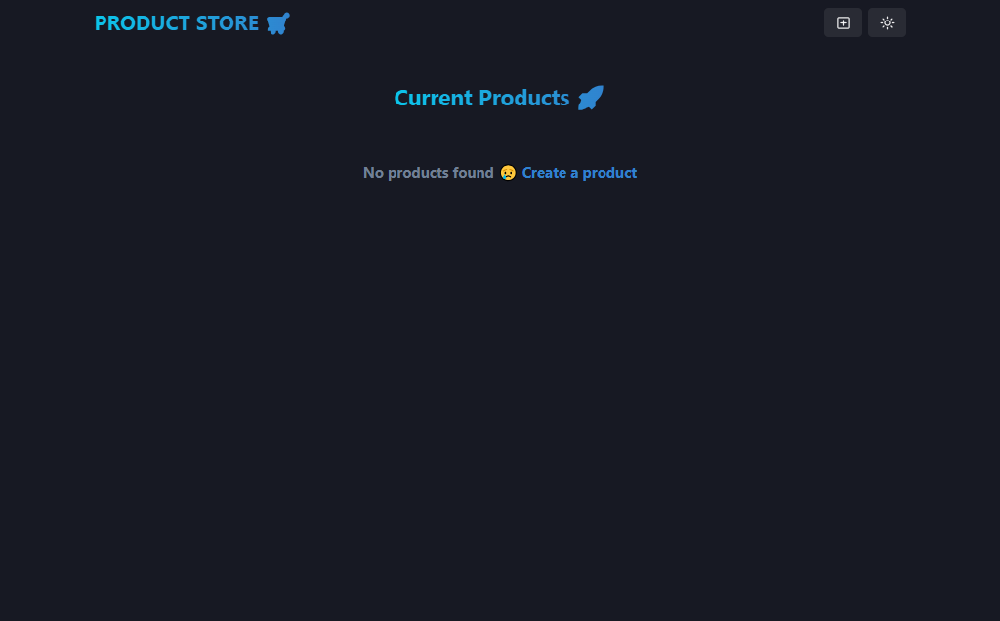
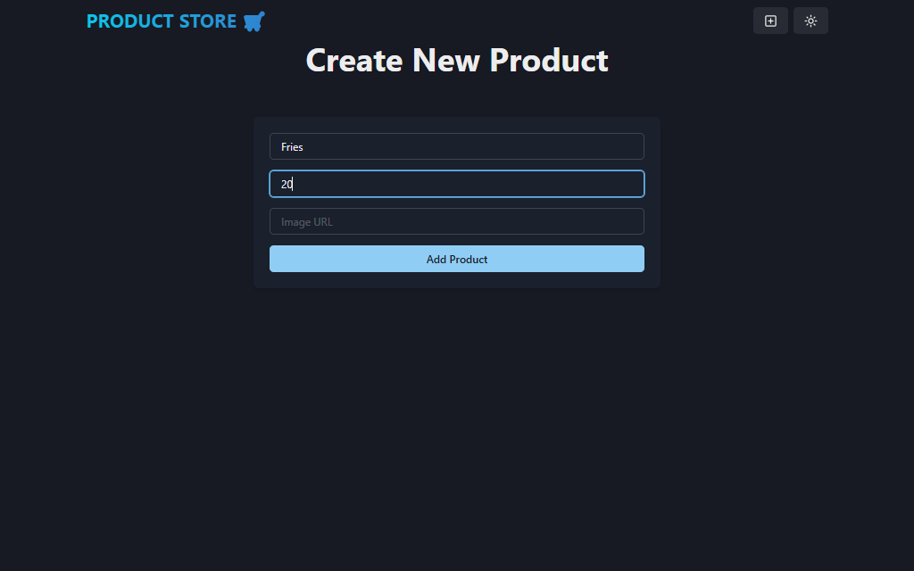
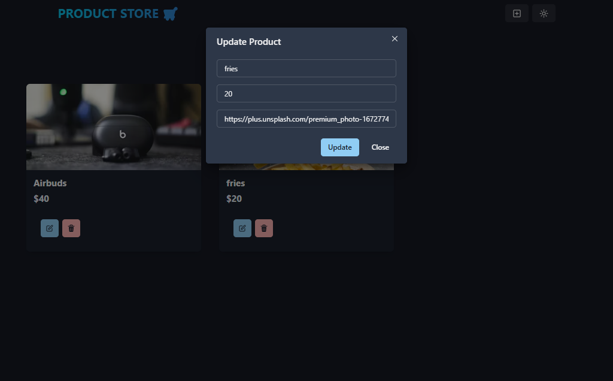

# MERN Product Store

A simple full-stack product store built with the MERN stack. Users can view products, add new products, update existing products, and delete products from the store.

## Preview

Live Demo: [mern-product-store-q9i0.onrender.com](https://mern-product-store-q9i0.onrender.com/)

## Screenshots

### Home Page


### Create Product Page


### Edit Product Modal


## Tech Stack

- MongoDB
- Express.js
- React
- Node.js
- Vite
- Chakra UI
- Zustand

## Features

- View all products
- Create a new product with name, price, and image URL
- Edit product details
- Delete products
- Light and dark mode UI
- REST API connected to MongoDB

## Project Structure

```text
mern-product-store/
|-- backend/
|   |-- config/
|   |-- controllers/
|   |-- models/
|   |-- routes/
|   `-- server.js
|-- frontend/
|   |-- public/
|   `-- src/
|       |-- components/
|       |-- pages/
|       `-- store/
|-- package.json
`-- README.md
```

## Getting Started

### 1. Clone the repository

```bash
git clone https://github.com/laibatariq110/mern-product-store.git
cd mern-product-store
```

### 2. Install dependencies

Install backend dependencies from the root folder:

```bash
npm install
```

Install frontend dependencies:

```bash
cd frontend
npm install
cd ..
```

### 3. Set up environment variables

Create a `.env` file in the root folder:

```env
MONGO_URI=your_mongodb_connection_string
PORT=5000
```

Replace `your_mongodb_connection_string` with your MongoDB connection string.

### 4. Run the app

Start the backend server:

```bash
npm run dev
```

In another terminal, start the frontend:

```bash
cd frontend
npm run dev
```

The frontend will run on the Vite development URL, usually:

```text
http://localhost:5173
```

The backend API runs on:

```text
http://localhost:5000
```

## API Routes

| Method | Route | Description |
| --- | --- | --- |
| GET | `/api/products` | Get all products |
| POST | `/api/products` | Create a new product |
| PUT | `/api/products/:id` | Update a product |
| DELETE | `/api/products/:id` | Delete a product |

## Build for Production

From the root folder, run:

```bash
npm run build
```

Then start the production server:

```bash
npm start
```

In production mode, Express serves the built React frontend from `frontend/dist`.

## Product Data

Each product has:

- `name`
- `price`
- `image`

Example:

```json
{
  "name": "Wireless Headphones",
  "price": 59.99,
  "image": "https://example.com/headphones.jpg"
}
```
